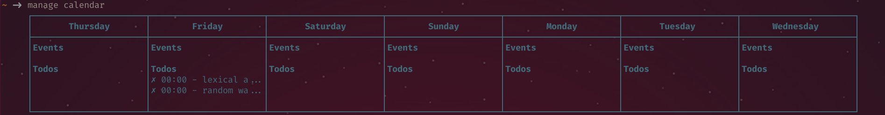
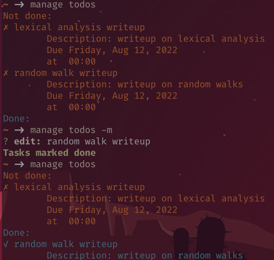
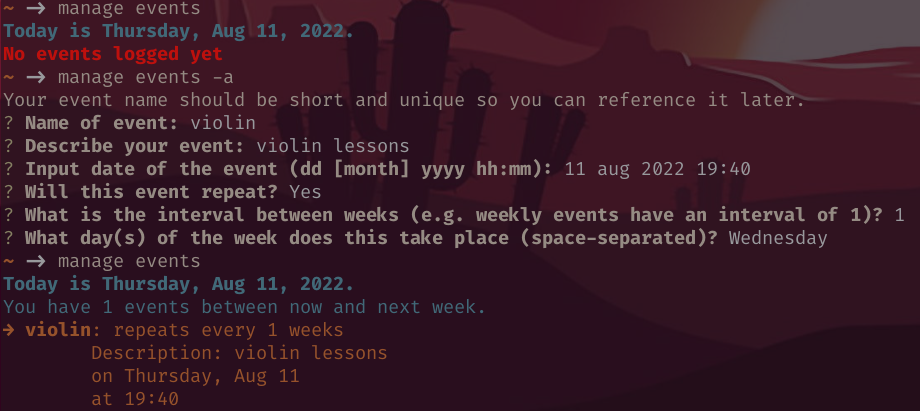

# Manage: a CLI tool to manage your tasks and events

Manage is a Nodejs CLI tool that manages your tasks and events.

## Installation
If you have npm on your machine, run `npm i tdmanage`. 

## Usage
To start, run `manage help` to see the possible commands.

`manage` will keep track of your todos and the events you have, and display a calendar when prompted. 

## Dependencies
This app uses `chalk`, `conf`, and `commander`. Works with nodejs version 16, but not with anything lower.